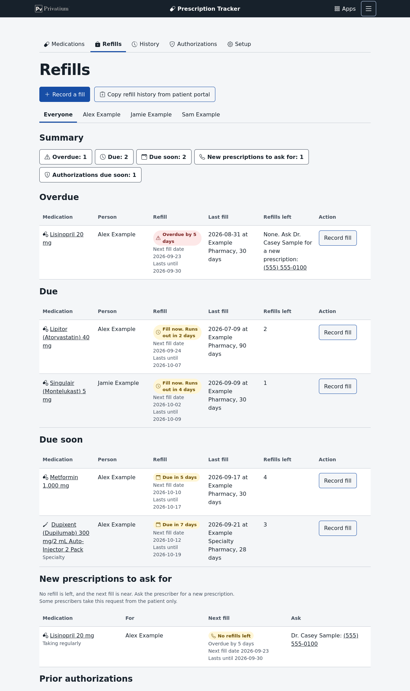

<!--
This file is part of Medication Tracker
README.md
Author(s): Gabriel Mongefranco
Created: 2026-09-26
Last Modified: 2026-10-05
Summary: Provides an overview of the project, in Markdown format.
Notes: See README file for documentation and full license information.

Copyright © 2026 Gabriel Mongefranco

This program is free software: you can redistribute it and/or modify
it under the terms of the GNU General Public License as published by
the Free Software Foundation, either version 3 of the License, or (at your option) any later version.
This program is distributed in the hope that it will be useful,
but WITHOUT ANY WARRANTY; without even the implied warranty of
MERCHANTABILITY or FITNESS FOR A PARTICULAR PURPOSE. See the
GNU General Public License for more details.
You should have received a copy of the GNU General Public License along
with this program. If not, see <https://www.gnu.org/licenses/>.

-->

# Medication Tracker

## Description
Medication Tracker helps a family keep track of everyone's prescriptions, so nobody runs out. It runs on your own computer with [Privatium](https://github.com/gabrielmongefranco/privatium), a free program that keeps your records at home instead of on a company's servers.

The app shows which refills are due and when to order them. It aims to refill while a small backup supply is still on hand, but never before your insurance will pay, so medicine doesn't pile up at home. It keeps each person's medication list, ready to print for a doctor's visit. You can record fills by hand, or copy them from your insurance plan's, pharmacy's or doctor's website. It also reminds you when a prescription has no refills left and when an insurance approval is about to end.

The app comes with a catalog of about 2,850 common medicine products in the United States. It can look up any other medicine by name in public drug lists from the U.S. government. Your records stay on your computer as plain files, with no account and no cloud. To back them up, you copy a folder.

Tested with Privatium v0.3.2.

**A note on your data.** Privatium stores every record as plain text by design. Anyone who can read the files on your computer can read what this app stores. So protect the computer and its backups the way you protect any papers with health information on them. [Privatium's security page](https://github.com/gabrielmongefranco/privatium/blob/main/docs/security.md) explains what the design does and does not protect.

## Quick Start Guide
1. Install Privatium. Download the release for your computer from the [Privatium README](https://github.com/gabrielmongefranco/privatium#quick-start-guide) and run it once. It creates a data folder and prints its location on a line that starts with `privatium: data in`. Then stop Privatium.
2. Download [meds.zip](https://github.com/gabrielmongefranco/privatium-app-meds/releases/latest/download/meds.zip) from the [latest release](https://github.com/gabrielmongefranco/privatium-app-meds/releases/latest) and unzip it. You get a folder named `meds`. Move it into the `apps` folder inside Privatium's data folder. The file `app.toml` must sit directly inside `meds`. If your computer made a `meds` folder inside another `meds` folder, move the inner one.
3. Start Privatium again and open the address it prints in your browser. Choose **Medication Tracker** from the list of apps.
4. Follow [Get started](docs/usage.md#get-started) in the user guide to add your family and your first medicines.

When Privatium starts, it warns that this app uses three online services. Those are the public drug lists the app searches when you look up a medicine that isn't in its catalog. The app sends them only the name you type.

Installing an app from someone you don't know deserves the same care as running a program someone emailed you. A Privatium app runs on your computer with access to its own records. Read the code, or ask someone you trust to read it, before you install an app you did not write.

## Documentation
The documentation is also on the [Medication Tracker website](https://dev.mongefranco.com/privatium-app-meds/).

+ **[User guide](docs/usage.md):** how to use every screen, with pictures.
+ **[Words to know](docs/glossary.md):** the pharmacy and insurance words the app uses, in plain language.
+ **[How the app works](docs/how-it-works.md):** how it picks refill dates, why it keeps a backup, and what stays private.
+ **For developers:** the [documentation index](docs/README.md) lists the architecture, the data model, and how to set up a development copy, run the tests, rebuild the catalog and publish a release. [`apps/meds/README.md`](apps/meds/README.md) describes the app folder, and [`SKILLS.md`](SKILLS.md) lists the guides an AI assistant reads before changing this repository.

## Additional Resources
+ [Privatium](https://github.com/gabrielmongefranco/privatium): the framework this app runs on.
+ [Your app in its own repository](https://github.com/gabrielmongefranco/privatium/blob/main/docs/app-repository.md): the guide this repository follows.

## About the Author

Medication Tracker is built by [Gabriel Mongefranco](https://gabriel.mongefranco.com), a database and
software architect who has spent two decades building data platforms in healthcare and
research — enterprise data warehouses, BI systems, knowledge bases, and the first architecture for mobile and
wearable research data at a large research university.

Learn more at: [Gabriel Mongefranco's website](https://gabriel.mongefranco.com).

## Contact

Questions, bug reports, enhancement ideas and requests are welcome as GitHub issues. Feel
free to send pull requests as well!

## Credits
### Authors:
+ [Gabriel Mongefranco](https://gabriel.mongefranco.com) [(@gabrielmongefranco)](https://github.com/gabrielmongefranco)

#### This work is based in part on the following projects, libraries and/or studies:
+ [Privatium](https://github.com/gabrielmongefranco/privatium): the local-first framework that stores, syncs and serves this app. This repository is an app folder that a Privatium node runs, and the `skills/privatium-*` folders are the assistant guides that Privatium exports. License: [GPL-3.0-or-later](https://www.gnu.org/licenses/gpl-3.0-standalone.html).
+ [ClinCalc DrugStats](https://clincalc.com/DrugStats/): the short drug catalog included in the built-in catalog is mostly sourced from ClinCalc DrugStats by Sean P. Kane, PharmD, licensed under [CC BY-SA 4.0](https://creativecommons.org/licenses/by-sa/4.0/). Data was enhanced with RxTerms data.
+ [RxTerms](https://clinicaltables.nlm.nih.gov/apidoc/rxterms/v3/doc.html) and [RxNorm](https://www.nlm.nih.gov/research/umls/rxnorm/index.html): the strengths, forms, brand names and product numbers of the built-in catalog, and the lookup of a new medication. This product uses publicly available data from the U.S. National Library of Medicine (NLM), National Institutes of Health, Department of Health and Human Services; NLM is not responsible for the product and does not endorse or recommend this or any other product.
+ [openFDA NDC Directory](https://open.fda.gov/apis/drug/ndc/): the lookup of a medication that RxTerms does not hold, and the unit that labels print for a strength. Data of the U.S. Food and Drug Administration. Do not rely on openFDA to make decisions regarding medical care.
+ Other libraries: none. The app bundles no JavaScript or Lua library beyond what Privatium provides. Its five browser scripts and its Lua modules were written for it.

## License
### Copyright Notice
Copyright © 2026 Gabriel Mongefranco

### Software and Library License Notice
This program is free software: you can redistribute it and/or modify it under the terms of the GNU General Public License as published by the Free Software Foundation, either version 3 of the License, or (at your option) any later version.

This program is distributed in the hope that it will be useful, but WITHOUT ANY WARRANTY; without even the implied warranty of MERCHANTABILITY or FITNESS FOR A PARTICULAR PURPOSE. See the GNU General Public License for more details.

You should have received a copy of the GNU General Public License along with this program. If not, see <https://www.gnu.org/licenses/gpl-3.0-standalone.html>.

### Documentation License Notice
Permission is granted to copy, distribute and/or modify this document 
under the terms of the GNU Free Documentation License, Version 1.3 
or any later version published by the Free Software Foundation; 
with no Invariant Sections, no Front-Cover Texts, and no Back-Cover Texts. 
You should have received a copy of the license included in the section entitled "GNU 
Free Documentation License". If not, see <https://www.gnu.org/licenses/fdl-1.3-standalone.html>

## Citation
If you find this repository, code or paper useful for your research, please cite it.

#### Citation Example:
>_Mongefranco, Gabriel (2026). Medication Tracker. Software. https://github.com/gabrielmongefranco/privatium-app-meds_

----

Copyright © 2026 Gabriel Mongefranco
