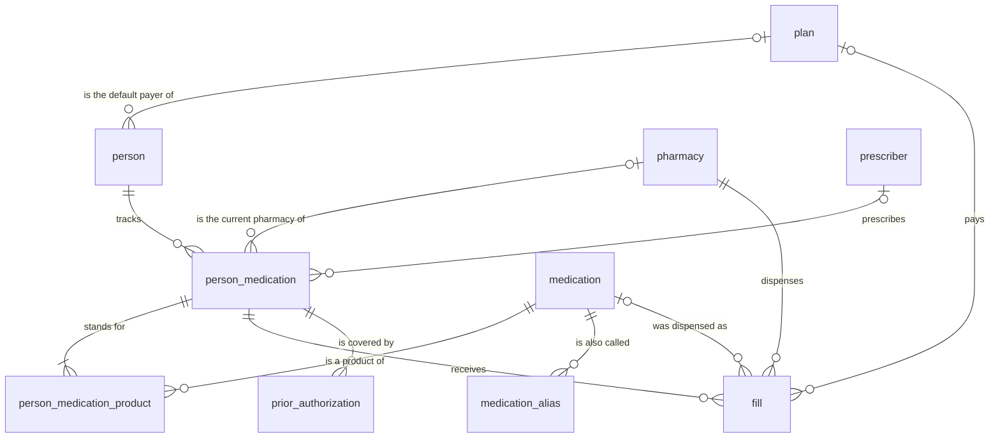

<!--
This file is part of Prescription Tracker
docs/data-model.md
Author(s): Gabriel Mongefranco
Created: 2026-09-26
Last Modified: 2026-10-03
Summary: Every table and view the app stores: grain, columns, meaning, which fields hold
         personal or health information, how the refill dates are worked out, and what
         the starter catalog holds.
Notes: See README file for documentation and full license information.

Copyright © 2026 Gabriel Mongefranco

Licensed under the GNU Free Documentation License v1.3 or later.
See <https://www.gnu.org/licenses/fdl-1.3.html>. See README for full license information.
-->

# Prescription Tracker

## Data model

[Back to project README](../README.md)

This page lists every table and view in `apps/meds/schema.sql`, what one row means, and
what each column holds. It is for anyone who reads the app's data files or changes its
schema. It changes in the same commit as the schema, so what you read here matches the
code.

Every table has screens, which [the usage page](usage.md) describes. The
[app design](design/README.md) explains the rules behind them.

### How the app stores data

Privatium keeps every record as one line of plain text in an append-only log under the
node's data directory, at `data/meds/log/<device>.jsonl`. The tables below are rebuilt
from that log on every start, so deleting the SQLite cache loses nothing. Saving a change
appends a new line that reuses the row's `id`. The latest line for an `id` wins. Nothing
is ever edited in place.

The log is not encrypted at rest. Anyone who can read the files can read every row.
[Privatium's security page](https://github.com/gabrielmongefranco/privatium/blob/main/docs/security.md)
explains what the design protects and what it leaves to the owner of the computer.

### Rules that shape the model

1. Every table has an `id` column that holds a ULID. A ULID is a 26-character identifier
   that sorts by the time it was made.
2. No table declares `UNIQUE`, because Privatium refuses it.
3. No table declares a foreign key. The code that saves a record checks that the records
   it points to exist.
4. No column relies on a default value. Privatium does not apply a column default when it
   saves, so the code supplies every value.
5. A change replaces the whole row. A save that leaves out a column clears it, so every
   save sends every column of the record.
6. Changes that belong together are written in one batch, so they land together.
7. Removing a record writes a marker that hides it. The original line stays in the log.
8. Dates are calendar dates in `YYYY-MM-DD` form, with no time zone. Money and quantities
   are exact decimal text, never floating-point numbers.

### Tables at a glance

The diagram shows the same facts as this list:

- A person tracks any number of medications. Each is a `person_medication` row with the
  name the person prefers.
- A tracked medication stands for one or more catalog products, through
  `person_medication_product`. A medication that comes in two carton sizes is one
  tracked medication with two products. One product belongs to at most one tracked
  medication of a person, so its fills are never counted twice.
- A tracked medication has any number of fills and prior authorizations. A fill may name
  the product that was dispensed.
- A catalog product has any number of other names.
- A pharmacy has any number of fills. Every fill names one pharmacy.
- A `person_medication` row may name a pharmacy and a prescriber.
- A prior authorization is an insurer's approval to cover a medication for a set period.
- A plan can be the default payer of several people and the payer of several fills.
- The `profile` table stands alone.

### Tables

The last column of each table marks the fields that hold personal or health information.
Every table also has an `id` column, which holds a ULID and no such information.

#### `profile`

Grain: one row per node. At most one row ever exists. The table holds the reminder
settings. It has no row until someone saves the settings, and saving them again amends
that row. With no row, every default is in force.

| Column | Type | Required | Meaning | Personal or health information |
|---|---|---|---|---|
| `due_within_days` | `BIGINT` | No | A refill is due when its next fill date is this many days away or fewer. Empty means 3. | No |
| `due_soon_within_days` | `BIGINT` | No | A refill is due soon when its next fill date is this many days away or fewer. Empty means 7. | No |
| `specialty_due_within_days` | `BIGINT` | No | The due count for a specialty medication. Empty means 5. | No |
| `specialty_due_soon_within_days` | `BIGINT` | No | The due soon count for a specialty medication. Empty means 10. | No |
| `authorization_notice_days` | `BIGINT` | No | A prior authorization is due soon when it expires in this many days or fewer. Empty means 30. | No |
| `authorization_due_within_days` | `BIGINT` | No | A prior authorization is due when it expires in this many days or fewer. Empty means 14. | No |
| `early_fill_percent` | `BIGINT` | No | Percent of the last fill allowed early, 0 to 100. Empty means 25. | No |
| `supply_frame_days` | `BIGINT` | No | Rolling frame, 0 to 3650. Empty means 180. Zero counts the last fill only; 3650 counts every fill. | No |
| `controlled_early_days` | `BIGINT` | No | Days early for controlled medications, 0 to 365. Empty means 0. | No |

The six reminder day counts must be zero or more. Forms limit them to 365. The view `v_reminder_default` holds the
defaults. The view `v_reminder_setting` returns the counts in force, with the defaults
filled in.

#### `plan`

Grain: one row per insurance plan or other payer. Its `id` links people and fills.
Plan names hold no member numbers. NULL settings inherit the household defaults.

| Column | Type | Required | Meaning | Personal or health information |
|---|---|---|---|---|
| `name` | `VARCHAR` | Yes | A name you recognize, without personal details | No |
| `early_fill_percent` | `BIGINT` | No | Early allowance, 0 to 100 percent. Zero waits for all physical supply to run out. | No |
| `supply_frame_days` | `BIGINT` | No | Rolling frame, 0 to 3650 days. Zero counts the last fill only; 3650 counts every fill. | No |

The app refuses removal while a person or fill points to the plan.

#### `person`

Grain: one row per household member whose medications the household tracks.

| Column | Type | Required | Meaning | Personal or health information |
|---|---|---|---|---|
| `display_name` | `VARCHAR` | Yes | The person's name as the app shows it | Personal |
| `birth_date` | `DATE` | No | Date of birth | Personal |
| `plan_id` | `VARCHAR` | No | `plan.id`, the current default payer. NULL means none. | Personal |

#### `medication`

Grain: one row per product. A product is a drug at one strength and form, or one supply
item. The same product under another spelling is a row of `medication_alias`, never a
second row here.

| Column | Type | Required | Meaning | Personal or health information |
|---|---|---|---|---|
| `short_name` | `VARCHAR` | Yes | The name the app shows everywhere | No |
| `generic_name` | `VARCHAR` | No | Generic name | No |
| `brand_name` | `VARCHAR` | No | Brand name | No |
| `strength` | `VARCHAR` | No | Strength as the label prints it, with the unit | No |
| `route` | `VARCHAR` | No | How it is given, such as `Oral` | No |
| `form` | `VARCHAR` | No | The form, such as `Tablet` | No |
| `package_size` | `VARCHAR` | No | How much one package holds, as text, such as `2` or `60 mL` | No |
| `package_type` | `VARCHAR` | No | The package, such as `Pack` or `Bottle` | No |
| `is_controlled` | `BOOLEAN` | No | Every fill counts across payers, without a frame limit. NULL means unmarked. | No |
| `is_specialty` | `BOOLEAN` | Yes | Whether this is a specialty medication, which takes longer to arrive and is due earlier | No |
| `rxcui` | `VARCHAR` | No | The RxNorm concept unique identifier (RxCUI) of the product: digits, kept as text | No |
| `source` | `VARCHAR` | No | The drug reference the row was copied from: `rxterms`, `rxnorm` or `openfda_ndc`. Empty when the owner typed the row. | No |
| `retrieved_on` | `DATE` | No | The local date the row was copied or refreshed. Empty when the owner typed the row. | No |

A medication needs a generic name or a brand name.

RxNorm is the drug list of the United States National Library of Medicine. It gives every
product a number, the RxCUI. Two medications never share an RxCUI and a package, and the
forms check that. Two packages of one product share the RxCUI. [The app design](design/README.md#the-catalog-and-the-drug-references)
explains how the catalog gets entries from the drug references.

The short name follows one pattern unless the owner types another: the brand name, the
generic name in brackets, the strength, the release form when the product has one, then
the package. Examples are `Lipitor (Atorvastatin) 20 mg`, `Metformin 500 mg 24 HR XR` and
`Examplol (Exampline) 10 mcg/mL 2 Pack`. A medication with no brand name leaves out the
brackets. A release form such as `24 HR XR`, `12 HR XR` or `DR` makes another product,
because an extended-release tablet is not interchangeable with the plain one. A pack of
tablets taken in a set order has no strength of its own; its name holds the count instead,
as in `Yasmin (Drospirenone / Ethinyl estradiol) Pack of 28`. A vitamin labeled in
international units shows units, as in `Cholecalciferol 1000 units`.

One product in two packages is two medications. A carton of 2 is another thing to refill
than a carton of 6, and a pharmacy bills them apart.

The strength is text because the app never calculates with it. One field holds a single
strength such as `10 mg`, a concentration such as `100 units/mL`, or the strengths of a
product with several drugs such as `875-125 mg`.

A catalog entry holds no health information until a person is linked to it.

#### `medication_alias`

Grain: one row per medication per other name.

| Column | Type | Required | Meaning | Personal or health information |
|---|---|---|---|---|
| `medication_id` | `VARCHAR` | Yes | The medication the name belongs to | No |
| `alias` | `VARCHAR` | Yes | The other name, kept as it was written | No |

#### `pharmacy`

Grain: one row per pharmacy or supplier.

| Column | Type | Required | Meaning | Personal or health information |
|---|---|---|---|---|
| `name` | `VARCHAR` | Yes | Name | No |
| `npi` | `VARCHAR` | No | National Provider Identifier (NPI), kept as text | No |
| `address` | `VARCHAR` | No | Street address | No |
| `phone` | `VARCHAR` | No | Phone number | No |
| `fax` | `VARCHAR` | No | Fax number | No |
| `email` | `VARCHAR` | No | Email address | No |
| `website` | `VARCHAR` | No | Website address | No |

#### `prescriber`

Grain: one row per prescriber.

| Column | Type | Required | Meaning | Personal or health information |
|---|---|---|---|---|
| `name` | `VARCHAR` | Yes | Name | Personal, about the prescriber |
| `clinic` | `VARCHAR` | No | Clinic or practice | No |
| `phone` | `VARCHAR` | No | Office phone number | No |
| `mobile_phone` | `VARCHAR` | No | Mobile phone number | Personal, about the prescriber |
| `fax` | `VARCHAR` | No | Fax number | No |
| `email` | `VARCHAR` | No | Email address | Personal, about the prescriber |
| `address` | `VARCHAR` | No | Street address | No |
| `website` | `VARCHAR` | No | Website address | No |
| `npi` | `VARCHAR` | No | National Provider Identifier, kept as text | No |

#### `person_medication`

Grain: one row per medication a person tracks, taken now or in the past. This is what
the Medications page lists. Its products are the rows of `person_medication_product`.

| Column | Type | Required | Meaning | Personal or health information |
|---|---|---|---|---|
| `person_id` | `VARCHAR` | Yes | The person | Health |
| `display_name` | `VARCHAR` | Yes | The preferred name, shown everywhere. It starts as the full name of the first product. Unique within one person; two people may use the same name. | Health |
| `medication_type` | `VARCHAR` | No | The kind of product and how long it is taken, such as `Prescription Medication - Long Term` | Health |
| `status` | `VARCHAR` | Yes | One of the five [status values](#status-values) | Health |
| `pharmacy_id` | `VARCHAR` | No | The pharmacy used now | No |
| `prescriber_id` | `VARCHAR` | No | The prescriber. Empty means self-prescribed. | Health |
| `prescribed_for` | `VARCHAR` | No | The condition the medication treats | Health |
| `instructions` | `VARCHAR` | No | How to take it | Health |
| `when_to_take` | `VARCHAR` | No | The time of day, such as `Morning` | Health |
| `refills_left` | `BIGINT` | Yes | Refills left on the current prescription, zero or more | Health |

The forms refuse a second tracked medication of the same person with the same preferred
name, compared without regard to case, spacing or punctuation.

#### `person_medication_product`

Grain: one row per tracked medication per catalog product. Every tracked medication has
at least one row here; the forms refuse to take the last product off. One product
belongs to at most one tracked medication of a person, which the forms check, because
the schema cannot declare it.

| Column | Type | Required | Meaning | Personal or health information |
|---|---|---|---|---|
| `person_medication_id` | `VARCHAR` | Yes | The tracked medication | Health |
| `medication_id` | `VARCHAR` | Yes | The catalog product | Health |

A tracked medication is a specialty or controlled medication when any of its products
carries the mark.

#### `fill`

Grain: one row per fill of one tracked medication. A fill is one pickup or one delivery.
The person is the one of the tracked medication.

| Column | Type | Required | Meaning | Personal or health information |
|---|---|---|---|---|
| `person_medication_id` | `VARCHAR` | Yes | The tracked medication | Health |
| `medication_id` | `VARCHAR` | No | The product that was dispensed, one of the products of the tracked medication. Empty when it is not known. | Health |
| `pharmacy_id` | `VARCHAR` | Yes | The pharmacy | No |
| `filled_on` | `DATE` | Yes | Date on the pharmacy label | Health |
| `rx_number` | `VARCHAR` | No | Prescription number | Health |
| `quantity` | `DECIMAL(18,3)` | No | Units dispensed, zero or more | Health |
| `days_supply` | `BIGINT` | No | Days the fill should last, zero or more | Health |
| `amount_paid` | `DECIMAL(18,2)` | No | What the household paid, zero or more, in the household's own currency | Personal |
| `plan_id` | `VARCHAR` | No | `plan.id`, the payer of this fill. NULL means unknown. | Personal |
| `insurance_claim_number` | `VARCHAR` | No | Claim number | Personal |
| `notes` | `VARCHAR` | No | Free text | Health |

#### `prior_authorization`

Grain: one row per approval window for one tracked medication. An insurer approves the
drug for one member, whatever carton it comes in.

| Column | Type | Required | Meaning | Personal or health information |
|---|---|---|---|---|
| `person_medication_id` | `VARCHAR` | Yes | The tracked medication | Health |
| `valid_from` | `DATE` | No | First day the approval covers. Empty when the household does not know it. | Health |
| `valid_to` | `DATE` | Yes | The expiration date: the last day the approval covers, on or after the first day | Health |

Only the expiration date drives the reminders, so an approval with no first day works
the same.

### Status values

The refill rules depend on the status, so the five values are fixed in the schema.

| Stored value | Meaning |
|---|---|
| `taking_regularly` | Taking regularly |
| `taking_as_needed` | Taking as needed |
| `on_hold` | On hold |
| `not_started` | Not started |
| `not_taking` | No longer taking |

### Choices

Five columns hold a choice as plain text: `route`, `form`, `package_type`,
`medication_type` and `when_to_take`. A line in the log reads `"route":"Oral"`, which
keeps the log readable without a lookup. No table holds the choices.

### Views

| View | Grain | Purpose |
|---|---|---|
| `v_active_medication` | One row per `person_medication` row in use | Everything about a tracked medication in use, in readable columns, with its refill status and its marks as 1 or 0 |
| `v_tracked_product` | One row per tracked medication per product | The products of each tracked medication with their names, marks and dose form; `position` orders them by short name |
| `v_entry_mark` | One row per tracked medication with a product | The count of products, and the specialty and controlled marks as 1 or 0, taken from the products |
| `v_supply` | One row per `person_medication` row | The last fill, eligibility (`next_fill_on`), exhaustion (`lasts_until`) and allowance in days |
| `v_last_fill` | One row per tracked medication with at least one fill | The latest fill |
| `v_fill_order` | One row per fill | Date/id sequence, days supply and payer membership |
| `v_supply_fill` | One row per fill | Physical and payer supply end dates for each possible start |
| `v_supply_frame` | One row per tracked medication with a fill | Earliest eligibility under the rolling frame |
| `v_medication` | One row per medication | The catalog with the full name |
| `v_medication_name` | One row per medication per distinct name | Every name a medication answers to |
| `v_reminder_default` | Exactly one row | The reminder and early refill defaults |
| `v_reminder_setting` | Exactly one row | The effective reminder and early refill settings |
| `v_spending_by_year` | One row per person per year with at least one fill | Number of fills and total paid |
| `v_row_count` | One row per table, `profile` included | Row counts |

In `v_medication`, the full name joins every part that is filled in: the generic name,
the brand name in brackets, the strength, the route, the form and the package.

Every view except `v_spending_by_year` leaves out the quantity and the amount paid.
Those columns need SQLite's decimal extension, which many SQLite tools lack. Without
them, any SQLite tool can run the other views against the cache file.

#### How the dates are worked out

The app works out two dates for each tracked medication, over the fills of all of its
products. They are estimates from recorded fills and rules, rather than a guarantee that
a claim will be paid.

1. The last fill is the one with the latest date. Ties use the greater record id.
2. Every fill adds supply. It starts on its date or when previous supply ends, whichever
   is later. Gaps earn no credit. `lasts_until` is when this physical supply runs out.
3. The payer's count includes fills under the last fill's plan and fills with no plan.
   If the last fill has no plan, every payer counts. Other plans add physical supply
   but do not enter this payer's count.
4. The allowance is the last fill's days supply times the effective early fill percent,
   rounded down. At 25 percent, 30 days allows 7 days early, and 90 allows 22.
5. The rolling frame is measured on the proposed next fill date, including its oldest
   boundary day. Older fills leave the count the following day. `next_fill_on` is the
   earliest date when the payer's remaining supply is within the allowance.
6. Frame 0 counts the last fill only, including when several fills share its date.
   Frame 3650 is a special value that counts every fill, even beyond ten years.
   For other frames, eligibility can also begin when the last counted fill leaves.
7. A controlled medication counts every fill across payers, without a frame limit.
   Its allowance is `controlled_early_days`, initially zero. A zero-percent payer for
   an ordinary medication waits for all physical supply to run out. A tracked
   medication is controlled, or specialty, when any of its products is marked so.

Plan settings override household settings. Empty overrides use 25 percent and 180 days
until you change the household defaults. Controlled medications use only their household
allowance. A missing days supply counts as 1 day; a recorded zero stays zero.

There is no January 1 reset. The rolling frame handles the history. Changing a person's
plan affects new fills; the latest recorded fill determines the current payer's count.

These fills are invented, under one plan with a 25 percent allowance and a 180-day frame.

| Filled on | Days supply |
|---|---|
| 2026-07-01 | 30 |
| 2026-07-28 | 30 |
| 2026-08-25 | 30 |
| 2026-08-25 | 90 |

Both fills on August 25 count. Physical supply lasts until December 28, 2026.
The last fill provides 90 days, so its allowance is 22 days. Eligibility begins
December 6, 2026.

For a gap followed by early fills, take 30-day fills on January 1, February 10 and
March 5, 2026. Supply from January runs out before February 10, so the gap contributes
nothing. Physical supply lasts until April 11. Eligibility begins April 4.

`v_active_medication` also exposes the marks `is_specialty` and `is_controlled` as 1 or
0, the count of `products`, `plan_name`, `allowance`, and both day counts. Dates remain calendar dates; day counts are integers.
`days_until_next_fill` may be negative while `days_until_runs_out` is still positive.

#### How the refill status is worked out

Overdue uses physical supply. Due and due soon use refill eligibility.
Checks run in the order shown, with household reminder settings applied.

| Refill status | Ordinary medication | Specialty medication |
|---|---|---|
| `no_fill` | No physical supply date | The same |
| `overdue` | `lasts_until` is before today | The same |
| `due` | Eligibility has passed, is today, or is up to 3 days away | Up to 5 days away |
| `due_soon` | Eligibility is 4 to 7 days away | 6 to 10 days away |
| `not_due` | Eligibility is more than 7 days away | More than 10 days away |

After eligibility passes, a row with supply left reads "Fill now. Runs out in N days".
On the exhaustion date it reads "Fill now. Runs out today". Overdue begins the next day
and counts days from exhaustion, rather than from eligibility.

Today is `date('now', 'localtime')`, the node computer's local calendar date.
SQLite's plain `date('now')` uses Coordinated Universal Time (UTC).

### Several devices

Privatium merges changes from several devices row by row, and the later change wins the
whole row. Two devices that edit the same record before they sync keep one of the two
edits.

### The starter catalog

`apps/meds/lib/starter_catalog.lua` holds a starter catalog and nothing else. The app loads
it by itself the first time a page needs the catalog and finds it empty.
The catalog has 2,757 medications and 601 other names for them. It holds the 200 drugs
most prescribed in the United States, and the drugs of the owner's list, at every strength
that RxTerms lists. It also holds entries written by hand, such as continuous glucose
monitors, and syringes and needles in many sizes. [How to build the starter catalog](how-to/build-the-starter-catalog.md) names
the sources and their licenses. It holds no person, no fill and no other record about anyone.

A Privatium node offers to load the file from its settings page only while the app's log
is empty. The file must never hold a real name, a date of birth, or a record of what a
person takes.

The catalog names products. It is not medical advice, and it says nothing about doses.
Some brand names in it are no longer sold. They stay because older labels and statements
still use them. Check the label in your hand before you rely on an entry.

### Conclusion

You now know each table and view, which fields are sensitive, how a tracked medication
relates to its catalog products, and how the two refill dates are worked out. Change `schema.sql` and this page together.

### Additional resources

- [Using the app](usage.md)
- [The app folder](../apps/meds/README.md)
- [App design](design/README.md), the planned screens.
- [Privatium's app contract](https://github.com/gabrielmongefranco/privatium/blob/main/spec/app-contract.md), the normative definition of an app and its data.
- [Privatium's data dictionary](https://github.com/gabrielmongefranco/privatium/blob/main/spec/data-dictionary.md), which defines the column types.
- [Privatium's security page](https://github.com/gabrielmongefranco/privatium/blob/main/docs/security.md)
- [Privatium's backup and restore guide](https://github.com/gabrielmongefranco/privatium/blob/main/docs/backup-and-restore.md), which names the data directory on each platform.

[Back to project README](../README.md)

----

Copyright © 2026 Gabriel Mongefranco
