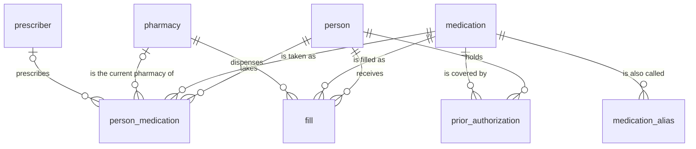

<!--
This file is part of Prescription Tracker
docs/data-model.md
Author(s): Gabriel Mongefranco
Created: 2026-09-26
Last Modified: 2026-09-27
Summary: Every table and view the app stores: grain, columns, meaning, which fields hold
         personal or health information, how the refill dates are worked out, and what
         the sample data holds.
Notes: See README file for documentation and full license information.

Copyright © 2026 Gabriel Mongefranco

Licensed under the GNU Free Documentation License v1.3 or later.
See <https://www.gnu.org/licenses/fdl-1.3.html>. See README for full license information.
-->

# Prescription Tracker

## Data model

[Back to project README](../README.md)

This page lists every table and view in `apps/meds/schema.sql`, what one row means, and
what each column holds. It is for anyone who reads the app's data files or changes its
schema. It changes in the same commit as the schema, so what you read here matches the
code.

Every table has screens, which [the usage page](usage.md) describes. The
[app design](design/README.md) explains the rules behind them.

### How the app stores data

Privatium keeps every record as one line of plain text in an append-only log under the
node's data directory, at `data/meds/log/<device>.jsonl`. The tables below are rebuilt
from that log on every start, so deleting the SQLite cache loses nothing. Saving a change
appends a new line that reuses the row's `id`. The latest line for an `id` wins. Nothing
is ever edited in place.

The log is not encrypted at rest. Anyone who can read the files can read every row.
[Privatium's security page](https://github.com/gabrielmongefranco/privatium/blob/main/docs/security.md)
explains what the design protects and what it leaves to the owner of the computer.

### Rules that shape the model

1. Every table has an `id` column that holds a ULID. A ULID is a 26-character identifier
   that sorts by the time it was made.
2. No table declares `UNIQUE`, because Privatium refuses it.
3. No table declares a foreign key. The code that saves a record checks that the records
   it points to exist.
4. No column relies on a default value. Privatium does not apply a column default when it
   saves, so the code supplies every value.
5. A change replaces the whole row. A save that leaves out a column clears it, so every
   save sends every column of the record.
6. Changes that belong together are written in one batch, so they land together.
7. Removing a record writes a marker that hides it. The original line stays in the log.
8. Dates are calendar dates in `YYYY-MM-DD` form, with no time zone. Money and quantities
   are exact decimal text, never floating-point numbers.

### Tables at a glance

The diagram shows the same facts as this list:

- A person has any number of `person_medication` rows, fills and prior authorizations.
- A medication has any number of `person_medication` rows, fills, prior authorizations
  and other names.
- A pharmacy has any number of fills. Every fill names one pharmacy.
- A `person_medication` row names one person and one medication. It may name a pharmacy
  and a prescriber.
- A prior authorization names one person and one medication. A prior authorization is an
  insurer's approval to cover a medication for a set period.
- The `profile` table stands alone.

### Tables

The last column of each table marks the fields that hold personal or health information.
Every table also has an `id` column, which holds a ULID and no such information.

#### `profile`

Grain: one row per node. At most one row ever exists. Saving the name again amends that
row.

| Column | Type | Required | Meaning | Personal or health information |
|---|---|---|---|---|
| `display_name` | `VARCHAR` | Yes | What the app calls the household. A family name or a nickname. | Personal, if a real name is entered |
| `due_within_days` | `BIGINT` | No | A refill is due when its next fill date is this many days away or fewer. Empty means 3. | No |
| `due_soon_within_days` | `BIGINT` | No | A refill is due soon when its next fill date is this many days away or fewer. Empty means 7. | No |
| `specialty_due_within_days` | `BIGINT` | No | The due count for a specialty medication. Empty means 5. | No |
| `specialty_due_soon_within_days` | `BIGINT` | No | The due soon count for a specialty medication. Empty means 10. | No |
| `authorization_notice_days` | `BIGINT` | No | Days before a prior authorization ends when a warning starts. Empty means 30. | No |

The five day counts must be zero or more. The view `v_reminder_default` holds the
defaults. The view `v_reminder_setting` returns the counts in force, with the defaults
filled in.

#### `person`

Grain: one row per household member whose medications the household tracks.

| Column | Type | Required | Meaning | Personal or health information |
|---|---|---|---|---|
| `display_name` | `VARCHAR` | Yes | The person's name as the app shows it | Personal |
| `birth_date` | `DATE` | No | Date of birth | Personal |

#### `medication`

Grain: one row per product. A product is a drug at one strength and form, or one supply
item. The same product under another spelling is a row of `medication_alias`, never a
second row here.

| Column | Type | Required | Meaning | Personal or health information |
|---|---|---|---|---|
| `short_name` | `VARCHAR` | Yes | The name the app shows everywhere | No |
| `generic_name` | `VARCHAR` | No | Generic name | No |
| `brand_name` | `VARCHAR` | No | Brand name | No |
| `strength` | `VARCHAR` | No | Strength as the label prints it, with the unit | No |
| `route` | `VARCHAR` | No | How it is given, such as `Oral` | No |
| `form` | `VARCHAR` | No | The form, such as `Tablet` | No |
| `package_size` | `VARCHAR` | No | Package size as text | No |
| `package_type` | `VARCHAR` | No | The package, such as `Bottle` | No |
| `is_specialty` | `BOOLEAN` | Yes | Whether this is a specialty medication, which takes longer to arrive and is due earlier | No |

A medication needs a generic name or a brand name.

The short name follows one pattern unless the owner types another: the brand name, the
generic name in brackets, then the strength. An example is
`Lipitor (Atorvastatin) 20 mg`. A medication with no brand name leaves out the brackets.

The strength is text because the app never calculates with it. One field holds a single
strength such as `10 mg`, a concentration such as `100 units/mL`, or the strengths of a
product with several drugs such as `875-125 mg`.

A catalog entry holds no health information until a person is linked to it.

#### `medication_alias`

Grain: one row per medication per other name.

| Column | Type | Required | Meaning | Personal or health information |
|---|---|---|---|---|
| `medication_id` | `VARCHAR` | Yes | The medication the name belongs to | No |
| `alias` | `VARCHAR` | Yes | The other name, kept as it was written | No |

#### `pharmacy`

Grain: one row per pharmacy or supplier.

| Column | Type | Required | Meaning | Personal or health information |
|---|---|---|---|---|
| `name` | `VARCHAR` | Yes | Name | No |
| `npi` | `VARCHAR` | No | National Provider Identifier (NPI), kept as text | No |
| `address` | `VARCHAR` | No | Street address | No |
| `phone` | `VARCHAR` | No | Phone number | No |
| `fax` | `VARCHAR` | No | Fax number | No |
| `email` | `VARCHAR` | No | Email address | No |
| `website` | `VARCHAR` | No | Website address | No |

#### `prescriber`

Grain: one row per prescriber.

| Column | Type | Required | Meaning | Personal or health information |
|---|---|---|---|---|
| `name` | `VARCHAR` | Yes | Name | Personal, about the prescriber |
| `clinic` | `VARCHAR` | No | Clinic or practice | No |
| `phone` | `VARCHAR` | No | Office phone number | No |
| `mobile_phone` | `VARCHAR` | No | Mobile phone number | Personal, about the prescriber |
| `fax` | `VARCHAR` | No | Fax number | No |
| `email` | `VARCHAR` | No | Email address | Personal, about the prescriber |
| `address` | `VARCHAR` | No | Street address | No |
| `website` | `VARCHAR` | No | Website address | No |
| `npi` | `VARCHAR` | No | National Provider Identifier, kept as text | No |

#### `person_medication`

Grain: one row per person per medication they take or took.

| Column | Type | Required | Meaning | Personal or health information |
|---|---|---|---|---|
| `person_id` | `VARCHAR` | Yes | The person | Health |
| `medication_id` | `VARCHAR` | Yes | The medication | Health |
| `medication_type` | `VARCHAR` | No | The kind of product and how long it is taken, such as `Prescription Medication - Long Term` | Health |
| `status` | `VARCHAR` | Yes | One of the five [status values](#status-values) | Health |
| `pharmacy_id` | `VARCHAR` | No | The pharmacy used now | No |
| `prescriber_id` | `VARCHAR` | No | The prescriber. Empty means self-prescribed. | Health |
| `prescribed_for` | `VARCHAR` | No | The condition the medication treats | Health |
| `instructions` | `VARCHAR` | No | How to take it | Health |
| `when_to_take` | `VARCHAR` | No | The time of day, such as `Morning` | Health |
| `refills_left` | `BIGINT` | Yes | Refills left on the current prescription, zero or more | Health |

#### `fill`

Grain: one row per fill of one medication for one person. A fill is one pickup or one
delivery.

| Column | Type | Required | Meaning | Personal or health information |
|---|---|---|---|---|
| `person_id` | `VARCHAR` | Yes | The person | Health |
| `medication_id` | `VARCHAR` | Yes | The medication | Health |
| `pharmacy_id` | `VARCHAR` | Yes | The pharmacy | No |
| `filled_on` | `DATE` | Yes | Date on the pharmacy label | Health |
| `rx_number` | `VARCHAR` | No | Prescription number | Health |
| `quantity` | `DECIMAL(18,3)` | No | Units dispensed, zero or more | Health |
| `days_supply` | `BIGINT` | No | Days the fill should last, zero or more | Health |
| `amount_paid` | `DECIMAL(18,2)` | No | What the household paid, zero or more, in the household's own currency | Personal |
| `insurance_plan` | `VARCHAR` | No | Name of the insurance plan | Personal |
| `insurance_claim_number` | `VARCHAR` | No | Claim number | Personal |
| `notes` | `VARCHAR` | No | Free text | Health |

#### `prior_authorization`

Grain: one row per approval window for one person and one medication.

| Column | Type | Required | Meaning | Personal or health information |
|---|---|---|---|---|
| `person_id` | `VARCHAR` | Yes | The person the insurer approved | Health |
| `medication_id` | `VARCHAR` | Yes | The medication | Health |
| `valid_from` | `DATE` | Yes | First day the approval covers | Health |
| `valid_to` | `DATE` | Yes | Last day the approval covers, on or after the first day | Health |

### Status values

The refill rules depend on the status, so the five values are fixed in the schema.

| Stored value | Meaning |
|---|---|
| `taking_regularly` | Taking regularly |
| `taking_as_needed` | Taking as needed |
| `on_hold` | On hold |
| `not_started` | Not started |
| `not_taking` | No longer taking |

### Choices

Five columns hold a choice as plain text: `route`, `form`, `package_type`,
`medication_type` and `when_to_take`. A line in the log reads `"route":"Oral"`, which
keeps the log readable without a lookup. No table holds the choices.

### Views

| View | Grain | Purpose |
|---|---|---|
| `v_active_medication` | One row per `person_medication` row in use | Everything about a medication in use, in readable columns, with its refill status |
| `v_supply` | One row per `person_medication` row | The last fill, the next fill date and the recommended next fill date |
| `v_last_fill` | One row per person per medication with at least one fill | The latest fill |
| `v_supply_window` | One row per person per medication with at least one fill | The fills that count toward the recommended next fill date |
| `v_medication` | One row per medication | The catalog with the full name |
| `v_medication_name` | One row per medication per distinct name | Every name a medication answers to |
| `v_reminder_default` | Exactly one row | The five day counts the app starts with |
| `v_reminder_setting` | Exactly one row | The five day counts in force |
| `v_spending_by_year` | One row per person per year with at least one fill | Number of fills and total paid |
| `v_row_count` | One row per table | Row counts |

In `v_medication`, the full name joins every part that is filled in: the generic name,
the brand name in brackets, the strength, the route, the form and the package.

Every view except `v_spending_by_year` leaves out the quantity and the amount paid.
Those columns need SQLite's decimal extension, which many SQLite tools lack. Without
them, any SQLite tool can run the other views against the cache file.

#### How the dates are worked out

1. The last fill is the fill with the latest date. When two fills share a date, the one
   entered later wins.
2. The next fill date is the date of the last fill plus its days supply. An empty days
   supply counts as 1 day.
3. The supply window opens at the start of the year of the last fill, or at the start of
   the month three months before it, whichever is earlier.
4. The supply in the window is the sum of the days supply of every fill in the window.
5. The recommended next fill date is the first fill date in the window plus that sum, or
   the next fill date when that is later.

This example uses invented fills of one medication for one person.

| Filled on | Days supply |
|---|---|
| 2026-07-01 | 30 |
| 2026-07-28 | 30 |
| 2026-08-25 | 30 |
| 2026-08-25 | 90 |

The last fill is the second one of 2026-08-25, with 90 days. The next fill date is
2026-11-23. The window opens on 2026-01-01 and holds all four fills, which add up to 180
days. The recommended next fill date is 2026-12-28, which is 180 days after 2026-07-01.

Three effects of these rules are worth knowing:

- When two fills share a date, the next fill date uses the days supply of the later one
  only. The recommended next fill date counts both.
- Supply left over from before the window opens is not counted.
- After a gap with no medication, the sum gives a date that is too early. The next fill
  date is later then, so it is the one returned.

#### How the refill status is worked out

`v_active_medication` compares the next fill date with today's date and the day counts.

| Refill status | Ordinary medication | Specialty medication |
|---|---|---|
| `overdue` | The next fill date is before today | The same |
| `due` | The next fill date is today or up to 3 days away | Today or up to 5 days away |
| `due_soon` | The next fill date is 4 to 7 days away | 6 to 10 days away |
| `not_due` | The next fill date is more than 7 days away | More than 10 days away |
| `no_fill` | No fill is recorded | The same |

Today is `date('now', 'localtime')`, the date in the time zone of the computer that runs
the query. SQLite's plain `date('now')` is the date in Coordinated Universal Time (UTC),
which is already tomorrow in the evening in the Americas.

### Several devices

Privatium merges changes from several devices row by row, and the later change wins the
whole row. Two devices that edit the same record before they sync keep one of the two
edits.

### Sample data

`apps/meds/sample/seed.jsonl` holds one invented household name and a starter catalog.
The catalog has 41 medications that are common in the United States, with 38 other names
for them. It holds no person, no fill and no other record about anyone.

A Privatium node offers to load the file from its settings page only while the app's log
is empty. The file must never hold a real name, a date of birth, or a record of what a
person takes.

The catalog names products. It is not medical advice, and it says nothing about doses.
Some brand names in it are no longer sold. They stay because older labels and statements
still use them. Check the label in your hand before you rely on an entry.

### Conclusion

You now know each table and view, which fields are sensitive, and how the two refill
dates are worked out. Change `schema.sql` and this page together.

### Additional resources

- [Using the app](usage.md)
- [The app folder](../apps/meds/README.md)
- [App design](design/README.md), the planned screens.
- [Import of the legacy database](design/import.md)
- [Privatium's app contract](https://github.com/gabrielmongefranco/privatium/blob/main/spec/app-contract.md), the normative definition of an app and its data.
- [Privatium's data dictionary](https://github.com/gabrielmongefranco/privatium/blob/main/spec/data-dictionary.md), which defines the column types.
- [Privatium's security page](https://github.com/gabrielmongefranco/privatium/blob/main/docs/security.md)
- [Privatium's backup and restore guide](https://github.com/gabrielmongefranco/privatium/blob/main/docs/backup-and-restore.md), which names the data directory on each platform.

[Back to project README](../README.md)

----

Copyright © 2026 Gabriel Mongefranco
