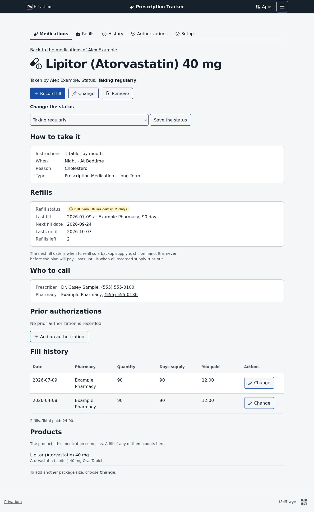
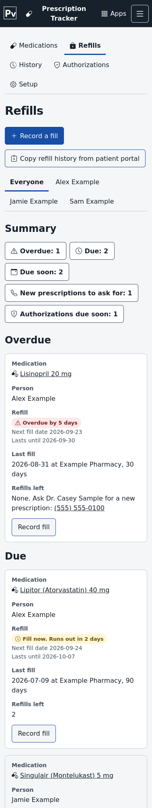
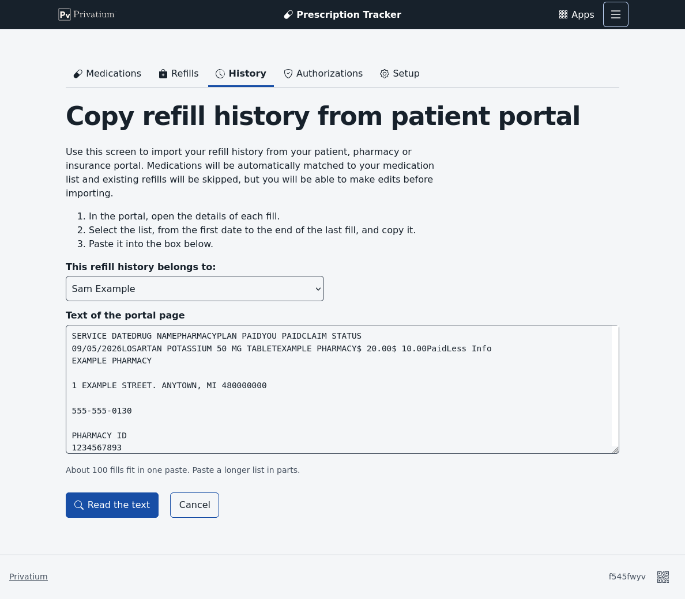
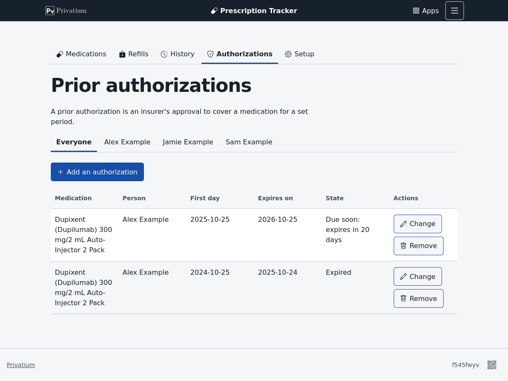
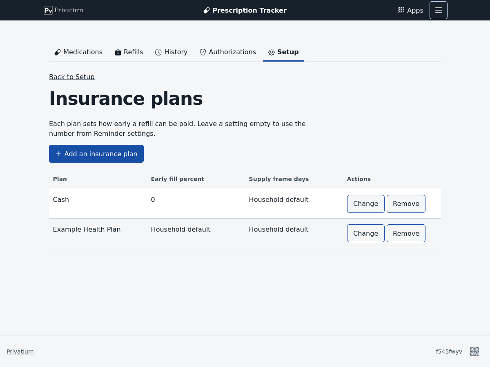
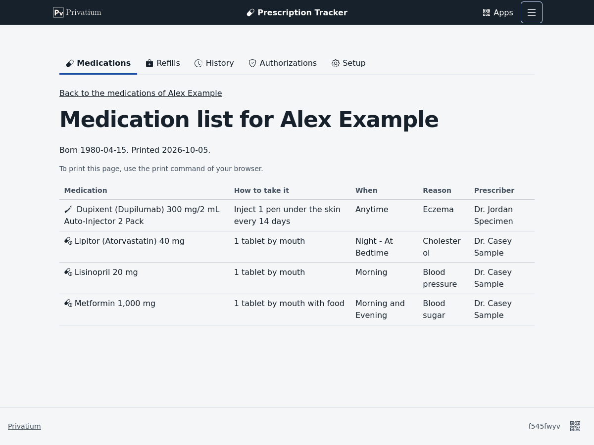
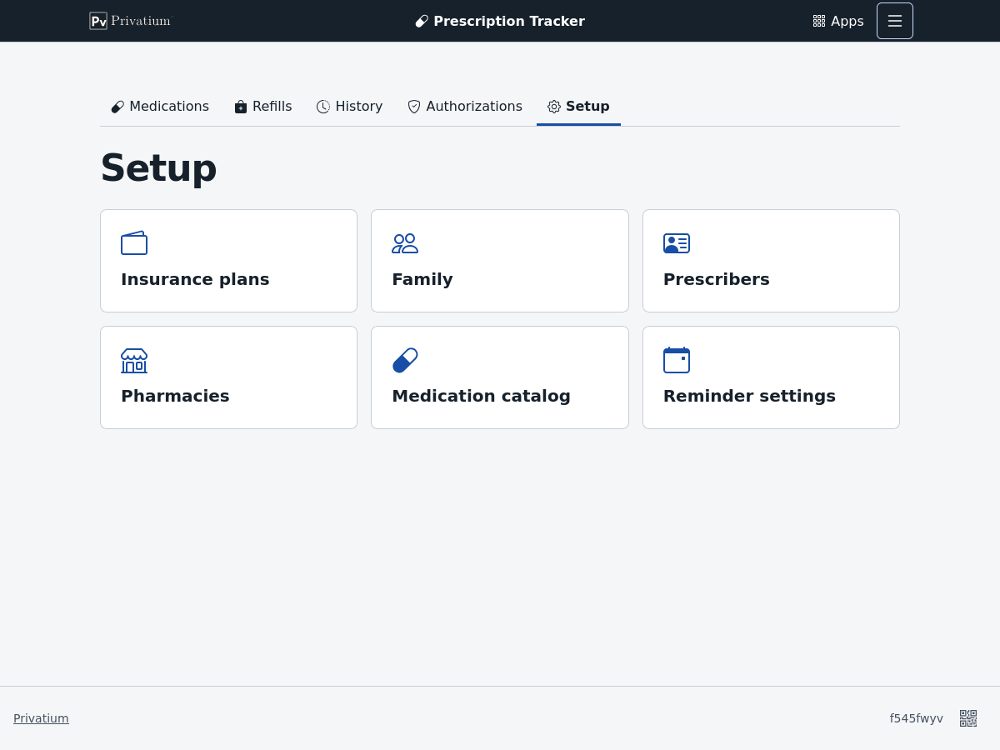

<!--
This file is part of Prescription Tracker
docs/usage.md
Author(s): Gabriel Mongefranco
Created: 2026-09-27
Last Modified: 2026-10-05
Summary: The user guide: how a family uses each screen of the app, from adding people and
         medications to recording fills, copying fills from a patient portal, prior
         authorizations, insurance plans and reminders.
Notes: See README file for documentation and full license information.

Copyright © 2026 Gabriel Mongefranco

Licensed under the GNU Free Documentation License v1.3 or later.
See <https://www.gnu.org/licenses/fdl-1.3.html>. See README for full license information.
-->

# Prescription Tracker

## User guide

[Back to project README](../README.md)

This guide shows you how to use Prescription Tracker to keep your family's medicines
in order. It is for anyone in the household, with no technical or pharmacy background
needed. If you are new to the app, read the first three sections, then jump to the task
you need.

When a word is new to you, look it up in [Words to know](glossary.md). Every person,
doctor and pharmacy in the pictures is invented.

### What the app does for you

Prescription Tracker answers three everyday questions:

- **What needs a refill, and when?** The Refills page lists what to order now and what
  is coming up. It aims to refill while a few days of medicine are still on hand, but
  never before your insurance will pay.
- **What does each person take?** The Medications page keeps each person's list, with
  how to take each medicine and who prescribed it. You can print it for a doctor's visit.
- **What did we get, and what did we pay?** The History page lists every fill and adds
  up what you paid.

It also reminds you when a prescription has no refills left and when an insurance
approval is about to end.

### Find your way around

The dark bar at the top belongs to Privatium, the program that runs this app.

- The **Privatium** logo on the left opens the list of all your Privatium apps.
- **Prescription Tracker** in the middle takes you back to this app's first page.
- **Menu** on the right holds extra actions for the page you are on, such as
  **Print list**, and Privatium's own settings.

Under the bar, the app has five tabs:

| Tab | What you find there |
|---|---|
| **Medications** | Each person's medicines. This is the first page you see. |
| **Refills** | What needs a refill now, and what is coming up |
| **History** | Every fill, and what you paid |
| **Authorizations** | Insurance approvals and when they end |
| **Setup** | Your family, prescribers, pharmacies, insurance plans, the medication catalog and the reminder settings |

On pages that list several people, a row of names sits under the heading. Choose a
name to see only that person, or **Everyone** to see the whole family. The app
remembers your last choice in this browser.

At the bottom of the page, Privatium shows a short message when your device goes
offline. Changes you make offline are kept and sent when the connection comes back.

### Get started

1. Choose **Setup**, then **Family**, and add each person. A first name is enough. A
   birth date is optional; it shows on the printed medication list.
2. Choose **Setup**, then **Insurance plans**, and add your plan. Use a name you will
   recognize, such as "Work insurance". Don't type member numbers. Then open each
   person under **Family** and choose their plan.
3. Add each person's medicines, as [Add a medicine to someone's list](#add-a-medicine-to-someones-list)
   shows.
4. Record the last fill of each medicine, so the app can work out the next one. You can
   type it, or copy it from your insurance website.

You don't have to set everything up first. Whenever a form asks for a person, doctor,
pharmacy or plan that isn't in the app yet, you can add it right there.

The app already knows about 2,850 common medicine products. This catalog loads by
itself the first time you open a page that needs it. It holds only medicine names, never
anything about your family.

### Add a medicine to someone's list

1. On the **Medications** page, choose **Track a new medication**.
2. Choose who takes it.
3. Under **Find the product**, type a few letters of the medicine's name into **Search
   the catalog**. Either the brand or the generic name works. Press Enter or choose
   **Find**.
4. Check the product that matches the label, then choose **Add to this medication**.
   Look closely at the strength and the form, such as tablet or capsule. On a phone you
   see 5 results at a time, and 10 on a bigger screen. A **Close match** tag means the
   name is only similar to what you typed, so read it carefully.
5. Check the **Preferred name**. It starts as the product's full name. Change it to the
   name your family uses, if you like.
6. Choose the **Status**, such as **Taking regularly**. Only medicines taken regularly
   get refill reminders.
7. Fill in what you know: how to take it, when, what it is for, refills left, the
   prescriber and the pharmacy. All of these are optional. You can add notes too, such
   as how to store it.
8. Choose **Save**.

**Same medicine, two box sizes.** Some medicines, like injection pens, come in boxes of
different sizes. Check both sizes in step 4, or add the second one later with **Add
another product**. Every fill of either box then counts toward the same medicine. A
product can be on only one of a person's medicines, so the app stops you from adding
it twice.

**Can't find it?** If the catalog has nothing under that name, the app searches public
drug lists from the United States government and shows what they have. You can also
choose **Search online databases** to do this at any time. Pick a result, and the app
fills in the name and strength for you to check. This needs an internet connection. The
app sends only the name you typed, never anything about your family.

**Still can't find it?** Open **Not in the list? Add a medication to the catalog**. Type
the brand name, the generic name or both. While you type, the app looks for similar
products, in case it already has the one you mean. If not, fill in the strength as the
label prints it, such as "10 mg". Then choose the route, the form and the package, and
choose **Add to this medication**. Tick **Controlled** or **Specialty** if the label or
your pharmacy says so.

### Change or stop a medicine

Choose a medicine on the Medications page to open its own page. It shows how to take
it, its refill dates, who to call, its insurance approvals, every fill and the products
behind it.

- To change the status, pick a new one and choose **Save the status**. For example,
  choose **On hold** while a doctor pauses a medicine.
- To change anything else, such as the name or the instructions, choose **Change**.
- When someone stops taking a medicine, set the status to **No longer taking**. It
  moves to a closed section at the bottom of the Medications page, and its history
  stays. **Restart** brings it back.

To find a medicine quickly, type in **Search the list** on the Medications page. The
list narrows as you type. It matches the name, the products, the prescriber and the
person.

| Status | Use it when |
|---|---|
| Taking regularly | The person takes it on a schedule. It gets refill reminders. |
| Taking as needed | The person takes it only now and then. Its dates are shown, with no reminders. |
| On hold | A doctor paused it. |
| Not started | It is prescribed, but the person hasn't begun it. |
| No longer taking | The person stopped. The history stays. |

### See what needs a refill

Choose **Refills**. The most urgent medicines are at the top. The summary row shows how
many are in each group, and each count jumps to its group.

| Group | What it means | What to do |
|---|---|---|
| **Overdue** | The medicine you recorded has run out. | Refill now. If you did refill, record the fill. |
| **Due** | The next fill date is 3 days away or fewer, or has passed. | Order the refill now. |
| **Due soon** | The next fill date is 4 to 7 days away. | Plan to order soon. |
| **New prescriptions to ask for** | No refills are left, and a refill is near. | Ask the prescriber for a new prescription. The row shows their phone number. |
| **Prior authorizations** | An insurance approval has ended or ends within 30 days. | Ask the prescriber to request a new approval. |
| **As needed** | Medicines taken as needed. | Nothing. The dates are there if you want them. |
| **Missing information** | No fill is recorded yet, or the last fill has no days supply. | Record a fill, or add the days supply. |
| **Not due yet** | Everything else. This group starts closed. | Nothing. |
| **Paused** | Medicines on hold or not started. | Nothing. |

A specialty medicine takes longer to arrive, so it shows as due at 5 days and due soon
at 10. You can change all these numbers in the
[reminder settings](#change-the-reminder-settings).

**The two dates.** Each row shows two dates:

- **Next fill date** is when the app suggests you refill. It leaves you a small backup
  supply, about 15 percent of the last fill and at least 7 days. It is never before your
  plan will pay.
- **Lasts until** is when all the medicine you have recorded would run out.

When the next fill date has passed, the row says "Fill now. Runs out in 4 days", for
example. It only becomes overdue after the medicine runs out. [How the app
works](how-it-works.md) explains these dates in more detail.

The page also works on a phone. Each row becomes a card that you can scroll through.

### Record a fill

1. On the Refills page, choose **Record fill** in the medicine's row.
2. Check the values. The form copies the pharmacy, the days supply, the quantity, the
   prescription number and the plan from the last fill, so often you only need the date
   and the amount.
3. If the medicine comes in more than one box size, choose the **Product** you got.
4. Type the amount you paid. A dollar sign is fine.
5. Check **Refills left after this fill**. It starts at one fewer than before. If you
   leave it empty, the app lowers the count by one.
6. Under **More details**, you can add the claim number and a note.
7. Choose **Save the fill**.

For a medicine that isn't on the Refills page, choose **Record a fill** at the top of the
page and pick the medicine. If nobody tracks that medicine yet, choose **-- Another
medication --**, pick the person and find the product. Saving the fill also adds the
medicine to that person's list.

### Copy fills from your insurance website

Your insurance plan's or pharmacy's website, often called a patient portal, lists the
fills it paid for. Instead of typing each one, you can copy the list and let the app read
it. Nothing is added until you check it.

1. On the portal, open the details of each fill, so they show on the screen.
2. Select the list from the first date to the end of the last fill, and copy it.
3. In the app, choose **Refills**, then **Copy refill history from patient portal**.
4. Choose who the fills belong to, paste the text and choose **Read the text**.
5. Check the review page, described below.
6. Choose **Add fills**.

The review page asks about each medicine name and each pharmacy only once, however many
fills use it.

**Medicines.** Portals spell names their own way, such as "LOSARTAN POTASSIUM 50 MG
TABLET". For each name, the page shows what the app found:

| The page says | What it means | What you do |
|---|---|---|
| Known name | The app has seen this name before. | Nothing |
| Matched | One medicine has the same name and strength. It is chosen for you. | Check it |
| Choose a medication | Some medicines are close. The best match is first. | Pick one |
| New name | Nothing in the catalog is like it. The app filled in a new medicine from the name. | Check the names and the strength |

You can always pick a different medicine instead. The app then remembers the portal's
name for that medicine, so next time it is a known name.

**Pharmacies.** The app matches a pharmacy by its number or its name. For a new one, it
offers to add it with the address and phone number from the portal.

**Fills.** Each fill has a check box labeled **Add this fill**.

| Result | What it means |
|---|---|
| Ready | Everything was read. The box is ticked for you. |
| Not paid | The plan didn't pay this claim. Tick it only if you did get the medicine. |
| Already recorded | You already have this fill, so it is left out. |
| Details missing | The details weren't open on the portal. Open them and copy again. |
| Could not read | A date or number didn't make sense. The row says which one. |

If you choose **Add fills** while a question is still open, the page comes back and
marks it. Each added fill uses the person's current plan and lowers that medicine's
refills left by one. Pasting the same list twice adds nothing the second time.

The app reads one portal layout. If your portal lays out its page differently, the
review says "No fills can be added from this text." Record those fills by hand.

### Keep track of insurance approvals

Some medicines need your plan's approval before it will pay. This is called a **prior
authorization**. It usually lasts a year. Your prescriber has to ask for a new one before
it ends, and that can take a couple of weeks.

1. Choose **Authorizations**, then **Add an authorization**.
2. Choose the medicine. If it isn't on anyone's list yet, choose **-- Another
   medication --**, pick the person and find the product.
3. Check the first day. The form starts with the first day of this month. Clear it if
   you don't know it.
4. Check the expiration date. Your plan's letter shows it. The form starts one year
   after the first day of this month.
5. Choose **Save**.

The Refills page warns you 30 days before an approval ends. From 14 days before, it
shows as due, meaning you should ask for a new one now. After a renewal, add the new
approval and the warning goes away.

### Set up insurance plans

The app uses your plan's rules to estimate the first day a refill will be paid.

1. Choose **Setup**, then **Insurance plans**, then **Add an insurance plan**.
2. Type a name you recognize. Leave out member numbers and other personal details.
3. Leave the two numbers empty to use the household settings, or type your plan's own:
   - **Early fill percent**: how much of the last fill may be left when the plan pays
     for the next one. At 25 percent, a 30-day fill can be refilled 7 days early, and a
     90-day fill 22 days early. Use 0 for cash or over-the-counter purchases.
   - **Supply frame**: how many past days the plan looks at, usually 180. Use 0 to
     count only the last fill, or 3650 to count every fill.
4. Choose **Save**.
5. Under **Setup**, **Family**, open each person and choose their current plan.

When a person changes plans, their old fills keep the plan that paid for them. History
shows the plan of each fill.

Controlled medicines follow stricter rules. They count every fill, whoever paid, and by
default they aren't refilled early at all.

### Change the reminder settings

1. Choose **Setup**, then **Reminder settings**.
2. Change any number. Each box shows the number the app uses now. To go back to the
   app's own number, clear the box.
3. Choose **Save**.

| Setting | Starts at | What it does |
|---|---|---|
| Due | 3 days | A refill is due this many days before its next fill date. |
| Due soon | 7 days | A refill is due soon this many days before. |
| Due, specialty | 5 days | The same, for a specialty medicine. |
| Due soon, specialty | 10 days | The same, for a specialty medicine. |
| Prior authorization due | 14 days | When to ask for a new approval. |
| Prior authorization due soon | 30 days | When to start planning for it. |
| Early fill percent | 25 percent | How early your plan usually pays for a refill. Each plan can have its own. |
| Backup supply percent | 15 percent | How much of a fill to keep as a backup. |
| Backup supply, at least | 7 days | The smallest backup. |
| Backup supply for a specialty medication, at least | 10 days | The smallest backup for a specialty medicine. |
| Supply frame | 180 days | How many past days of fills count. |
| Days early for controlled medications | 0 days | How early a controlled medicine may be refilled. |

Here is an example. A 90-day fill that runs out on March 30 keeps a 13-day backup, 15
percent of 90. So its next fill date is March 17, as long as the plan will pay by then.

### See your history and spending

Choose **History** to see every fill, newest first. You can narrow the list by person,
medicine, pharmacy or year. Under the filters, the page counts the fills and adds up
what you paid. The **Paid by year** table shows each person's total for each year,
which helps at tax time.

To fix or remove a fill, choose **Change** in its row.

### Print a medication list

A current list is handy for a doctor's visit or an emergency.

1. Choose **Medications**, then choose one person.
2. Open **Menu** in the top bar and choose **Print list**. It appears only when one
   person is chosen.
3. Use your browser's print command.

The printed page leaves out the bars and buttons. It shows the medicines the person
takes now, and a second table of the ones on hold. Treat a printed list like any paper
with health details on it.

### Find a medicine by any name

Every search box looks at the brand name, the generic name and any other names a
product has. Capital letters and punctuation don't matter.

| You type | The app shows |
|---|---|
| Part of a name, such as "atorva" | The medicines whose names start that way |
| A name with a typo, such as "Lipitro" | The closest names, under **Did you mean one of these?** |

Some different medicines have names that look alike. So the app never picks a close
match for you. Read the name before you choose it.

**Teach the app another name.** A label, a bill and a person may each call a medicine
something different. Choose **Setup**, then **Medication catalog**, and search for the
name you use. Under **Teach the app this name**, choose the medicine it belongs to.
From then on, every search finds the medicine by that name. You can also open a
medicine in the catalog and type the name under **Add another name**.

### Fix the catalog

The catalog is the list of medicine products the app knows. Usually you add to it
from inside a form, as [Add a medicine to someone's list](#add-a-medicine-to-someones-list)
shows. The catalog page has every field.

**Add a product.**

1. Choose **Setup**, then **Medication catalog**.
2. Search first, to make sure it isn't there already.
3. Choose **Add a medication**.
4. Type the brand name, the generic name or both.
5. Type the strength as the label prints it, with the unit, such as "10 mg" or "100
   units/mL".
6. Pick the route, the form and the package type, or choose **-- Add new --** and type
   your own.
7. Tick **Specialty** or **Controlled** if they apply. The starter catalog suggests these
   marks, but plans differ, so check them.
8. Leave the short name empty, and the app builds one such as "Lipitor (Atorvastatin) 40
   mg". Type one only if you want a different name.
9. Choose **Save**.

**Merge two entries for the same product.** If the catalog has one product twice, under
two names, open the one that should go away and choose **Merge into another
medication**. Find the one to keep, choose **Keep this one**, read what will happen, and
choose **Merge**. Its fills and names move to the one you keep. A merge can't be undone,
so only merge entries with the same strength.

### Remove a record

Every **Remove** button asks first. Choose **Remove** to go ahead, or **Keep it** to go
back.

The app won't remove a person, product, medicine, pharmacy, prescriber or plan that
other records still use. The page tells you what uses it. To keep a medicine's history
but take it off the active list, change its status to **No longer taking** instead.

Removing hides the record in the app. Privatium still keeps the original on your
computer, as part of its history of changes.

### When a form comes back with problems

If something in a form isn't right, the form comes back with a list of problems at the
top. Each problem links to its field. Everything you typed is still there.

### About dates and your data

All dates use the clock of the computer that runs Privatium. If you open the app while
traveling in another time zone, you still see that computer's date.

Your records stay on your own computer as plain text files. Anyone who can open those
files can read them, so protect the computer and its backups as you would any health
papers. [How the app works](how-it-works.md#your-privacy) explains what the app sends
over the internet, which is only medicine names when you search online.

### Conclusion

You can now keep each person's medicine list, record fills by hand or from your
insurance website, and see what needs a refill before it runs out. For the reasons
behind the dates, read [How the app works](how-it-works.md).

### Additional resources

- [Words to know](glossary.md)
- [How the app works](how-it-works.md)
- [Compliance](compliance.md): the security and accessibility checks
- [Privatium's guide to using your apps](https://github.com/gabrielmongefranco/privatium/blob/main/docs/usage.md)
- [Privatium's security page](https://github.com/gabrielmongefranco/privatium/blob/main/docs/security.md)

[Back to project README](../README.md)

----

Copyright © 2026 Gabriel Mongefranco
